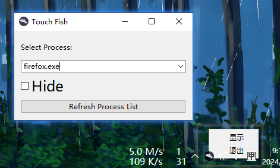

# Touch Fish

Loaf on the job.



## Introduction

Input or Select the Process you want to hide or restore first.

Then:

Check the `Hide` checkbox or Click the  hotkey `Alt` + `Z` to Hide the Select Process.

Uncheck the `Hide` checkbox or Click the hotkey `Alt` + `X` to Restore the Select Process.

If you can't find the Process you want to control, you can push the `Refresh Process List` button to refresh the list.

Left-click on the tray icon to show / hide the main window.

Right-click on the tray icon to show the context menu.

## Usage

```python
pip install -r requirements.txt
python touch_fish.py    
```

Or

```python
pip install PySide6==6.6.2, PyWin32, psutil, keyboard
python touch_fish.py
```
